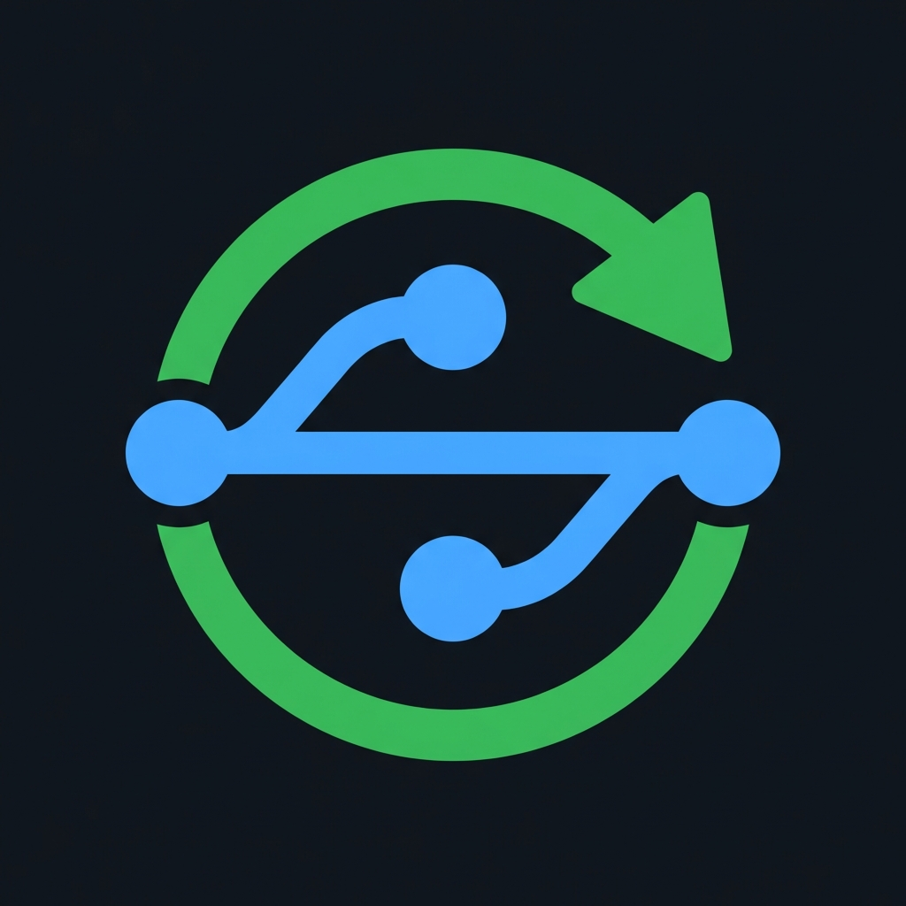

# Git Status Dashboard



A local web dashboard that scans your project directories for Git repositories and shows their status at a glance — uncommitted changes, branches ahead/behind, detached heads, and more. Runs entirely on your machine as a persistent macOS LaunchAgent.

## Features

- Scans one or more project directories for Git repositories
- Shows uncommitted changes, ahead/behind counts, branch name, and remote status per repo
- Filter by status: All, Uncommitted, Ahead/Behind, Clean, No Remote
- Open any repo directly in VS Code or reveal it in Finder
- **Delete** a repository folder from disk (with confirmation dialog)
- **Auto-refresh** on a tunable interval (30s → 30m) — setting persists across page reloads
- **Check for Updates** — runs `git pull` on the dashboard itself and shows the output
- **Restart Server** — triggers a graceful restart via the UI (launchd auto-restarts the process)
- Runs entirely locally — no external services, no telemetry

## Requirements

- [Bun](https://bun.sh) runtime (v1.0+)
- macOS (installer uses launchd; the server itself is cross-platform)

## Quick Start

```sh
bun run server.ts
```

Open [http://localhost:3847](http://localhost:3847) in your browser.

## First-Launch Setup

On the first run, the dashboard will prompt you to enter one or more project directories to scan:

```
Git Status Dashboard — First-time setup

Enter project directories to scan (comma-separated, default: ~/code):
>
```

Press **Enter** to accept the default (`~/code`), or type a comma-separated list of directories:

```
> ~/code, ~/work/projects, /opt/repos
```

The configuration is saved to `config.json` next to `server.ts` and the server starts immediately.

## Configuration

The config file lives at `config.json` in the same directory as `server.ts`:

```json
{
  "projectDirs": [
    "~/code",
    "~/work/projects"
  ]
}
```

To add or remove directories, edit `config.json` directly and restart the server. Each entry should be an absolute path (or `~/` shorthand) to a directory whose immediate subdirectories are Git repositories.

## Auto-start on Login (macOS)

The included installer registers the dashboard as a macOS **LaunchAgent** so it starts automatically every time you log in — no terminal required.

### Install

```sh
./install.sh
```

The installer will:

1. Verify Bun is installed
2. Prompt you to configure `config.json` if it doesn't exist yet
3. Write a LaunchAgent plist to `~/Library/LaunchAgents/com.git-status-dashboard.plist`
4. Load the agent immediately (no reboot required)
5. Open `http://localhost:3847` in your browser

After installation, the server starts on every login and automatically restarts if it ever crashes.

### Uninstall

```sh
./uninstall.sh
```

Stops the server, unloads the LaunchAgent, and removes the plist. Your `config.json` is left in place.

### Logs

While running as a LaunchAgent, output is written to:

| Stream | Location |
|--------|----------|
| stdout | `~/Library/Logs/git-status-dashboard.log` |
| stderr | `~/Library/Logs/git-status-dashboard.error.log` |

### Re-installing after moving the repo

The plist contains absolute paths resolved at install time. If you move the repository to a different location, run `./install.sh` again to update those paths.

## Port

The dashboard runs on port **3847**. To change it, edit the `PORT` constant at the top of `server.ts` and re-run the installer if you have it set up as a LaunchAgent.

## Project Layout

```
git-status-dashboard/
├── server.ts        # Bun HTTP server + git scanning logic + embedded UI
├── config.json      # Your directory config (created on first run)
├── favicon.jpg      # App icon (served at /favicon.jpg and /favicon.ico)
├── install.sh       # macOS LaunchAgent installer
└── uninstall.sh     # Reverses the installer
```

## How It Works

On each `/api/repos` request, the server:

1. Reads the list of directories from `config.json`
2. Scans each directory for subdirectories containing a `.git` folder
3. Runs `git rev-parse`, `git status --porcelain`, `git remote`, and `git rev-list` in parallel (concurrency: 8) to gather branch, uncommitted, and ahead/behind data
4. Returns the results as JSON; the browser renders them as cards

Each git operation has a 5-second timeout to prevent a single slow repo from blocking the scan.

## API Endpoints

| Method | Path | Description |
|--------|------|-------------|
| GET | `/api/repos` | Scan all configured directories and return repo statuses |
| GET | `/api/config` | Return current `config.json` contents |
| POST | `/api/open` | Open a repo path in VS Code |
| POST | `/api/reveal` | Reveal a repo path in Finder |
| POST | `/api/delete` | Delete a repo folder from disk (path must be within configured dirs) |
| POST | `/api/update` | Run `git pull` on the dashboard repo itself |
| POST | `/api/restart` | Exit the process (launchd restarts it automatically) |
